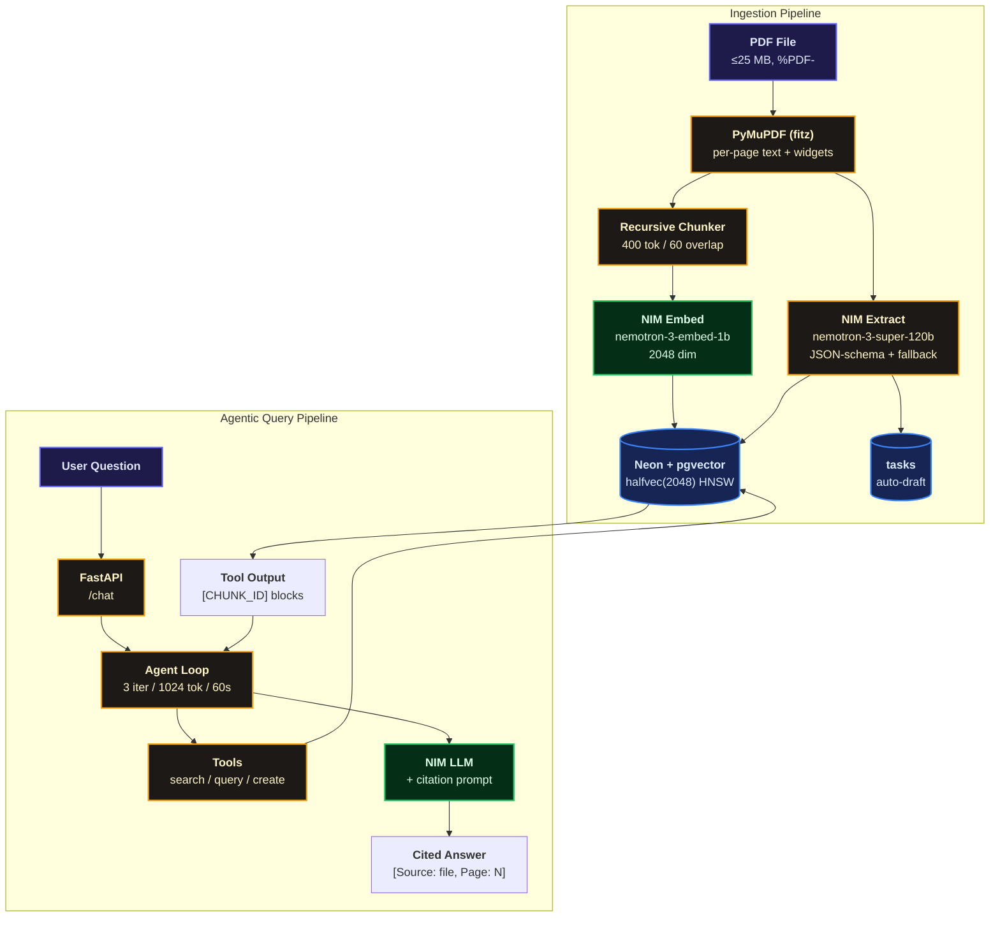

# LifeOS Agent — Your Personal Document Assistant

> LifeOS reads your bills, policies, and records, pulls out the important details and deadlines, and answers your questions with proof — always showing you exactly which document each answer came from.

Most of adult life runs on paperwork: electricity bills, insurance renewals, tax notices, rental agreements. The dates and amounts that matter are buried inside PDFs, and missing one means late fees or a lapsed policy. LifeOS is a private assistant that reads those documents for you, remembers every deadline, and answers questions like "when does my car insurance expire?" — pointing at the exact page it got the answer from, so you never have to take its word for it.

## Overview

Here's what happens in plain terms. You upload a PDF — say, an electricity bill. LifeOS reads every page and cuts the text into small searchable pieces. It converts each piece into a kind of fingerprint (an "embedding") so it can later find meaning, not just keywords. At the same time, it pulls out the structured facts: who sent it, how much, what's the due date, and whether you need to do something about it. If there's a deadline, it puts a task on your list automatically.

When you ask a question, LifeOS doesn't just guess. It works like a careful assistant: it looks up the relevant pieces of your documents, and if it needs exact facts (like "which bills are due next month?"), it checks the extracted details directly. Then it answers in a sentence or two, with a small source chip after every fact — click it and you see the filename, page number, and the exact quoted lines. Everything is strictly private: every piece of data belongs to your account, and the database itself refuses to show one user another user's documents.

## Features

- **An agent that looks things up before answering** — instead of following one fixed script, it decides on its own what to search for, checks up to three sources, and only then answers. If your documents don't contain the answer, it says so instead of making something up.
- **Answers with proof attached** — every fact comes with a clickable source chip showing the document, page, and exact quote. A wrong citation is impossible by design: the app only accepts references to text it actually showed the AI.
- **Deadlines become tasks on their own** — when a document contains a due date, a task appears on your list automatically, sorted with the most urgent first. Tick them off, or delete the ones you don't need.
- **Strictly your eyes only** — all isolation is enforced inside the database itself, not just in the app code, so your bills and policies can never leak into someone else's account.
- **Handles messy real-world PDFs** — reads multi-column layouts in the right order, picks up filled-in form fields, and tells you clearly when a file is just scanned images with no readable text (instead of failing silently).
- **Survives bad days gracefully** — if the AI service is slow or down, your upload is still saved and searchable; the document is simply marked for review rather than breaking the whole page. Deleting a document cleans up its tasks too.

## Architecture



## Tech Stack

| Layer | Technology |
|-------|------------|
| Frontend | Next.js 15 (App Router, React 19) + TypeScript + Tailwind CSS + Tabler.io (`@tabler/core` 1.5.1, `@tabler/icons-react` 3.46.0) |
| Backend | Python 3.11 + FastAPI 0.115.6 + Uvicorn + SQLAlchemy[asyncio] + asyncpg |
| AI | NVIDIA NIM `nemotron-3-super-120b-a12b` (tool calling) + `nemotron-3-embed-1b` (2048) via `openai.AsyncOpenAI` + `httpx` (15 s default; 30 s + 1 retry for chat turns and extraction) |
| Data | Neon Serverless Postgres + `pgvector 0.8.6` (`vector(2048)` → `halfvec(2048)` HNSW `halfvec_cosine_ops`) |
| Parsing | PyMuPDF (`fitz`) — sorted reading order, block fallback, AcroForm widgets, scanned-page detection; `page_number` preserved for citations |
| Auth | Self-managed JWT (`PyJWT` + `bcrypt` 72B cap) + RLS `FORCE` |

## Data Model

| Table | Purpose | RLS |
|-------|---------|-----|
| `users` | self-managed identity (`id`, `email`, `hashed_password`) | — (login must read before tenant ctx) |
| `documents` | `filename`, `category`, `status` (`ready`/`needs_review`), `raw_text`, `metadata JSONB`, `has_actionable_deadline` | `FORCE` |
| `document_chunks` | `document_id`, `user_id`, `filename`, `page_number`, `chunk_index`, `content`, `embedding vector(2048)` | `FORCE` |
| `tasks` | `title`, `due_date DATE`, `status`, `document_id ON DELETE CASCADE` | `FORCE` |
| `audit_logs` | `action_type`, `tool_name`, `input/output JSONB`, `execution_time_ms` | `FORCE` |

Indexes: `user_id`, `metadata->>'action_deadline'`, `category`, and `USING hnsw ((embedding::halfvec(2048)) halfvec_cosine_ops)`.

## Project Structure

```text
LifeOS/                        # branch: main
├── backend/
│   ├── app/
│   │   ├── main.py              # FastAPI, CORS, 504/502 handlers, /health, /
│   │   ├── config.py            # Settings (DATABASE_URL, NVIDIA_*, JWT, timeouts, agent tuning)
│   │   ├── database.py          # normalize_database_url, engine, RLS helpers, audit
│   │   ├── nim.py               # AsyncOpenAI client, embed_texts / chat_completion(timeout, retries)
│   │   ├── ingestion.py         # PyMuPDF (sort/widgets/scan flags), chunker, extraction + fallback
│   │   ├── schemas.py           # Pydantic v2, coerce_iso_date, _strip_to_float
│   │   ├── security.py          # bcrypt + JWT
│   │   ├── agent/
│   │   │   ├── loop.py          # 3-iter loop, SYSTEM_PROMPT, [CHUNK_ID] formatting
│   │   │   └── tools.py         # search_documents, query_structured_data, create_task
│   │   └── routers/
│   │       ├── auth.py          # signup / login / me
│   │       ├── documents.py     # upload (resilient), list, get, delete(204, cascades tasks)
│   │       ├── chat.py          # render_citations (verbatim 20-word)
│   │       └── tasks.py         # list (due-date order) + PATCH + DELETE(204)
│   ├── schema.sql               # DDL + halfvec HNSW + RLS FORCE + tenant policies
│   ├── requirements.txt         # Pinned (fastapi 0.115.6, pgvector 0.3.6, PyMuPDF 1.25.2, ...)
│   └── .env.example
├── frontend/
│   ├── src/app/page.tsx         # Dashboard (Dropzone + DocumentList + ChatPane + TaskList)
│   ├── src/app/login/page.tsx   # Sign in / Create account
│   ├── src/components/ChatPane.tsx  # Citation chips, scope select, rounded input
│   ├── src/components/DocumentList.tsx, Dropzone.tsx, TaskList.tsx
│   ├── src/lib/api.ts, src/lib/utils.ts
│   └── next.config.ts, tailwind.config.ts, tsconfig.json
├── README.md
├── RUN.md
└── .gitignore
```

## Example Questions

**Structured (via `query_structured_data`)**
- Which policies expire next month?
- List my utility bills due before 2026-10-01.
- Show all Vehicle documents from AutoCare Motors.

**Semantic (via `search_documents` + citation)**
- When does my car insurance expire? — should cite `policy_retry.pdf` Page 1.
- What does my rental agreement say about the deposit?
- What are the terms for vehicle service invoice INV-2026-8844?

**Action (via `create_task`)**
- Create a task to renew my insurance on 2026-10-10.
- Remind me to pay the electricity bill by 2026-10-15.

## Deployment

| Component | Local URL | Notes |
|-----------|-----------|-------|
| Frontend | `http://localhost:3000` | `npm run dev` (Next 15.1.6) |
| Backend | `http://localhost:8000` | `uvicorn app.main:app --reload` (`/docs` for Swagger) |


## Author

Built with ❤️
